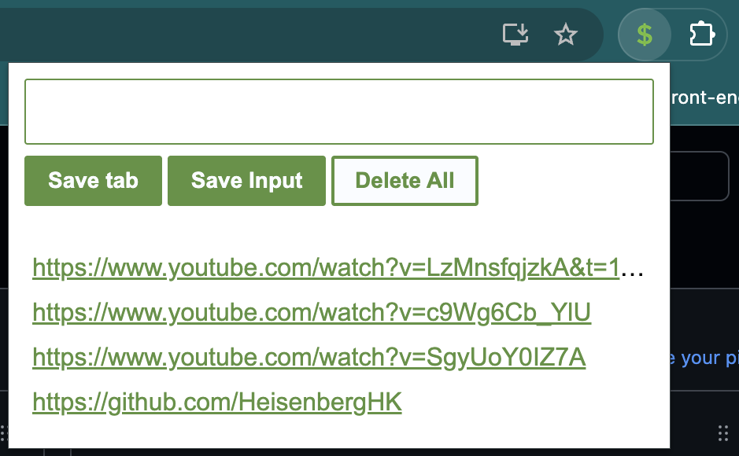

# 🚀 Lead Tracker - Your Personal URL Collector

_Never lose a great link again!_

## 🎯 What Does This Thing Do?

Lead Tracker is a sleek Chrome extension that turns you into a URL-hoarding ninja! Whether you're researching, shopping, or just procrastinating productively, this little green machine keeps track of all your important links.

## ✨ Features That'll Make You Smile

### 🔗 **Save Current Tab**

Click "Save tab" and BAM! The current page URL gets added to your collection faster than you can say "bookmarks are so last decade."

### ⌨️ **Manual URL Entry**

Type any URL into the input field and hit "Save Input" - perfect for those links your friend texted you at 2 AM.

### 🗑️ **Nuclear Option**

Double-click "Delete All" to wipe your entire collection clean. It's like Marie Kondo for your URLs - sometimes you just need a fresh start!

### 💾 **Persistent Storage**

Your links stick around even after closing Chrome, thanks to localStorage magic. No cloud, no fuss, just local goodness.

## 🎨 The Look

- Clean green theme (#5d923f) that's easy on the eyes
- Compact 400px width - won't hog your screen real estate
- Clickable links that open in new tabs (because nobody likes losing their place)
- Smooth hover effects that feel just right

## 🛠️ How It Works

1. **Install** the extension in Chrome
2. **Click** the extension icon to open the popup
3. **Save** URLs either by clicking "Save tab" or typing them manually
4. **Click** any saved link to open it in a new tab
5. **Double-click** "Delete All" when you need a clean slate

## 🔧 Tech Stack

- **HTML5** - The foundation
- **CSS3** - Making it pretty
- **Vanilla JavaScript** - No frameworks, just pure JS power
- **Chrome Extensions API** - For that sweet tab access
- **localStorage** - Your personal data vault

_Built with ❤️ and probably too much coffee_
